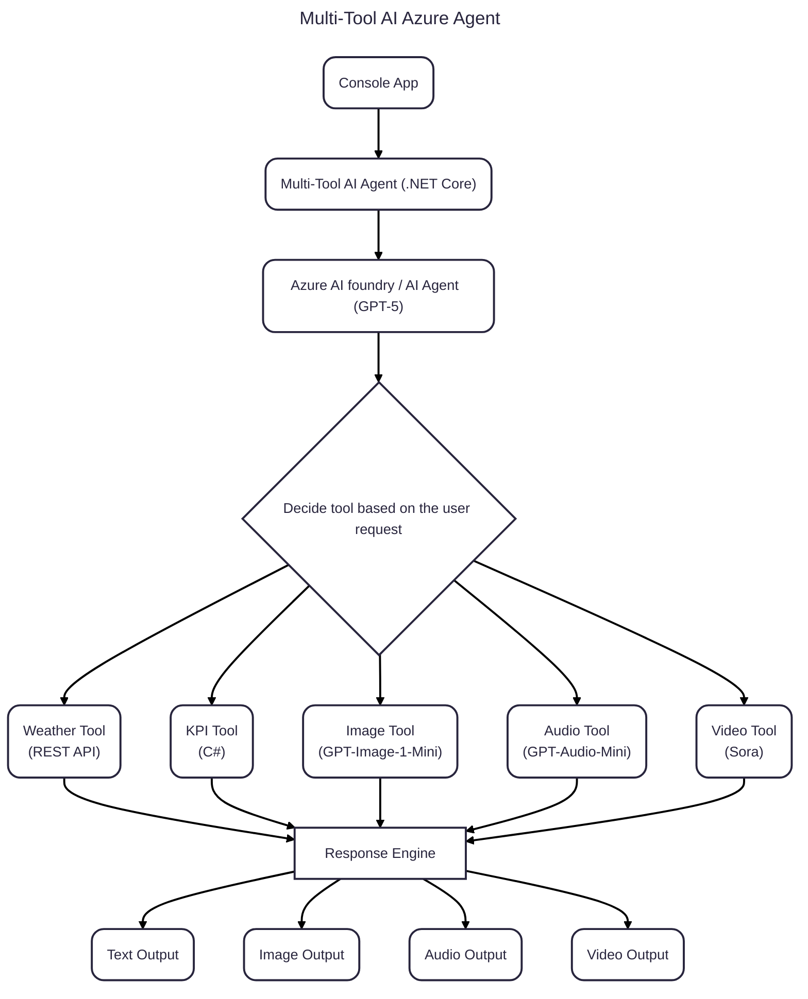

# Multi-Tool AI Azure Agent

A **.NET 8 multimodal AI agent** that intelligently connects to multiple tools — KPI lookup, Weather API, Image generation, Audio narration, and Video generation — powered by Azure AI Foundry (GPT-5, GPT-Image-1-Mini, GPT-Audio-Mini, Sora-style video).

This agent understands natural language, determines which tool to invoke, combines results, and produces unified outputs, including text, images, audio, and videos.

---
**Capabilities**

🧠 1. Reasoning & Orchestration (GPT-5)
- Natural language understanding
- Dynamic tool selection
- Multi-step, multi-tool reasoning
- TL;DR summaries and structured output

📊 2. KPI Intelligence (C# Tool)
- Quickly returns definitions for KPIs (MRR, NPS, etc.)
- Lightweight and local for instant response

🌦️ 3. Real-Time Weather (REST Tool)
- Uses the Open-Meteo geocoding + forecast API
- Returns live temperature (C/F) for any location
- Fully stateless and latency-optimized

🖼️ 4. Image Generation (GPT-Image-1-Mini)
- Creates visuals based on user prompts
- Ideal for dashboards, summaries, and thumbnails

🔊 5. Audio Narration (GPT-Audio-Mini)
- Converts summaries to high-quality speech WAV files
- Great for reports, voice assistants, and daily briefings

🎬 6. Video Generation (Sora-style Endpoint)
- Generates MP4 videos from prompts
- Produces dynamic, short clips (e.g., 3–10 seconds)
- Automatic HTML “playground” viewer included

---

## Features

- 🤖 **AI Agent Core**  
  Built on Azure OpenAI for intelligent orchestration, contextual reasoning, and data-driven decision-making.

- 📊 **Local KPI Integration**  
  Fetches and analyzes local business Key Performance Indicators via REST APIs.

- 🌦️ **Weather Intelligence**  
  Integrates with third-party Weather REST APIs to blend environmental data with operational insights.

- ☁️ **Azure-Native Design**  
  Runs seamlessly on Azure App Service, Functions, or Container Apps.

- 🧩 **Extensible Architecture**  
  Easily add new APIs or data sources — the modular design supports pluggable connectors.

- 🔒 **Secure and Scalable**  
  Follows Azure security best practices for authentication, logging, and monitoring.

---

## 🏗️ Architecture Overview

---

**Setup & Requirements**
**Prerequisites**

1. .NET 8 SDK
1. Azure AI Foundry Project (or Azure OpenAI Resource)
1. Deployed models:
- GPT-5
- GPT-Image-1-mini
- GPT-Audio-mini
- Sora (preview)

---

**Why This Project Exists**

1. This repository demonstrates:
1. Multi-tool agent patterns
1. Tool orchestration
1. Real-time REST integration
1. Multimodal generation across text, audio, image, and video
1. .NET best practices for AI workloads
1. Azure-native authentication and design

---

## Try these prompts (see multi-tool routing)

- What's the temperature in Herndon in F?
- Weather check for Chennai in c
- Compare MRR and NPS, and also tell me the current temperature in Dublin.
- Define NPS and give me the weather in Seattle.

---

## Sample: 

---
