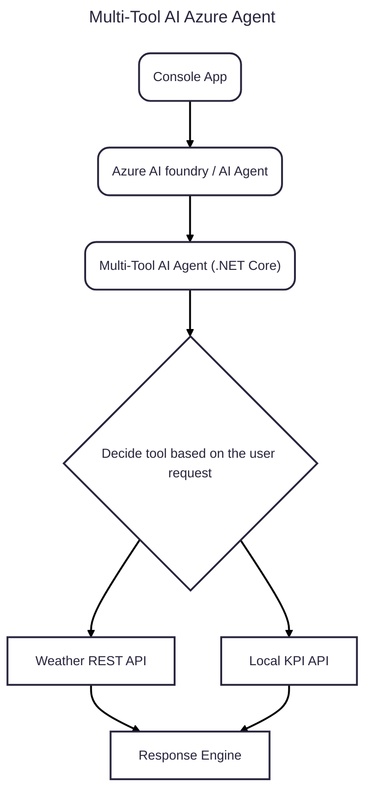

# Multi-Tool AI Azure Agent

A **.NET-based intelligent agent framework** that connects to multiple tools and APIs — including **Local KPI** and **Weather REST APIs** — to provide real-time insights, contextual automation, and analytics powered by **Azure AI**.

---

## Features

- 🤖 **AI Agent Core**  
  Built on Azure OpenAI for intelligent orchestration, contextual reasoning, and data-driven decision-making.

- 📊 **Local KPI Integration**  
  Fetches and analyzes local business Key Performance Indicators via REST APIs.

- 🌦️ **Weather Intelligence**  
  Integrates with third-party Weather REST APIs to blend environmental data with operational insights.

- ☁️ **Azure-Native Design**  
  Runs seamlessly on Azure App Service, Functions, or Container Apps.

- 🧩 **Extensible Architecture**  
  Easily add new APIs or data sources — the modular design supports pluggable connectors.

- 🔒 **Secure and Scalable**  
  Follows Azure security best practices for authentication, logging, and monitoring.

---

## 🏗️ Architecture Overview

```mermaid
---
title: Multi-Tool AI Azure Agent
config:
  theme: redux
  layout: dagre
---
flowchart TD
    A("Console App") --> B("Azure AI foundry / AI Agent")
    B --> C("Multi-Tool AI Agent (.NET Core)")
    C --> M{"Decide tool based on the user request"}
    M --> D["Local KPI API"] & E["Weather REST API"]
    E --> G["Response Engine"]
    D --> G
```
---

## Security architecture

This repo demonstrates the three security pillars from the blog post
[AI agents need security engineering, not just guardrails](#).

### 1. Managed Identity (no secrets in code)

The agent authenticates to Azure using `DefaultAzureCredential`.
Locally, this resolves via `az login`. In Azure, it uses the resource's
Managed Identity.

Required role assignments:
| Resource | Role |
|---|---|
| Azure AI Foundry project | Azure AI User |
| Azure Blob Storage (if used) | Storage Blob Data Reader |
| Azure AI Search (if used) | Search Index Data Reader |

**No connection strings. No API keys. No secrets in appsettings.json.**

### 2. Input validation (Security/InputGuard.cs)

Every user message passes through `InputGuard.Validate()` before
reaching the model. This checks for:
- Obvious prompt injection patterns ("ignore previous instructions", etc.)
- Out-of-domain inputs (anything unrelated to weather, KPIs, or media)
- Excessive length

Retrieved content (from tools or documents) is wrapped in explicit
delimiters using `InputGuard.WrapRetrievedContent()` to separate it
from trusted instructions in the prompt.

### 3. Audit trail (Security/AgentTelemetry.cs)

Every tool call is traced with OpenTelemetry and shipped to Azure
Application Insights (when `APPLICATIONINSIGHTS_CONNECTION_STRING` is set).
In local development, traces are written to the console.

You can answer these questions for any request:
- Which tool was called and with what input?
- How long did it take?
- What did it return?

### Required environment variables

| Variable | Purpose |
|---|---|
| `AZURE_AI_PROJECT_ENDPOINT` | Your Azure AI Foundry project endpoint |
| `APPLICATIONINSIGHTS_CONNECTION_STRING` | Azure Monitor (optional locally) |

Set these in your local environment or in Azure App Settings.
Do not put them in `appsettings.json` or `.env` files committed to Git.

---

## Try these prompts (see multi-tool routing)

- What's the temperature in Herndon in F?
- Weather check for Chennai in c
- Compare MRR and NPS, and also tell me the current temperature in Dublin.
- Define NPS and give me the weather in Seattle.

---
## Sample: 

---
